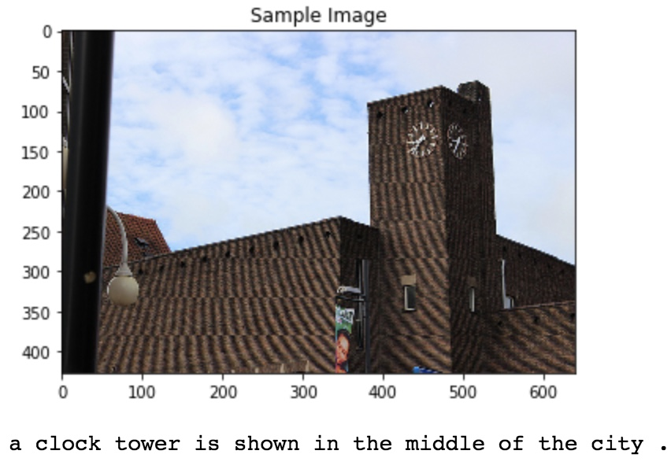
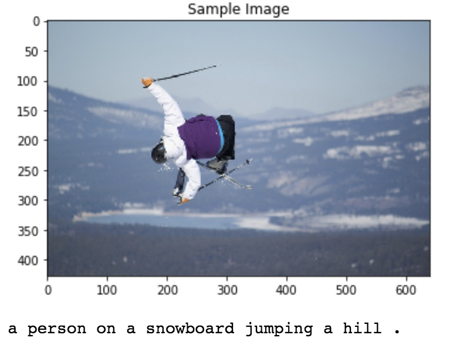
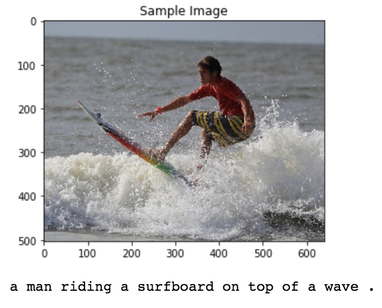
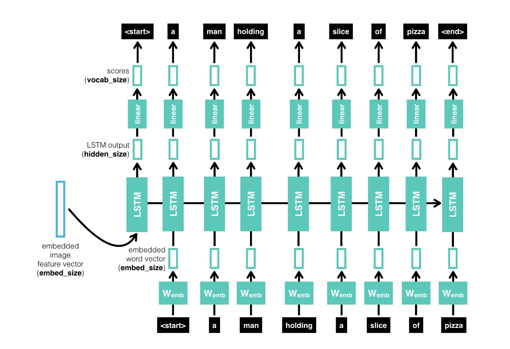

### 项目的实现效果







### 结构



### 训练

```python
import torch
import torch.nn as nn
from torchvision import transforms
import sys
sys.path.append('opt/cocoapi/PythonAPI')
from pycocotools.coco import COCO
from data_loader import get_loader
from model import EncoderCNN, DecoderRNN
import math

batch_size = 256          # batch size
vocab_threshold = 5        # minimum word count threshold
vocab_from_file = True    # if True, load existing vocab file
embed_size = 256           # dimensionality of image and word embeddings
hidden_size = 512          # number of features in hidden state of the RNN decoder
num_epochs = 1             # number of training epochs
save_every = 1             # determines frequency of saving model weights
print_every = 100          # determines window for printing average loss
log_file = 'training_log.txt'       # name of file with saved training loss and perplexity

transform_train = transforms.Compose([ 
    transforms.Resize(230),                          # smaller edge of image resized to 256
    transforms.RandomCrop(224),                      # get 224x224 crop from random location
    transforms.RandomHorizontalFlip(),               # horizontally flip image with probability=0.5
    transforms.ToTensor(),                           # convert the PIL Image to a tensor
    transforms.Normalize((0.485, 0.456, 0.406),      # normalize image for pre-trained model
                         (0.229, 0.224, 0.225))])

# Build data loader.
data_loader = get_loader(transform=transform_train,
                         mode='train',
                         batch_size=batch_size,
                         vocab_threshold=vocab_threshold,
                         vocab_from_file=vocab_from_file)

# The size of the vocabulary.
vocab_size = len(data_loader.dataset.vocab)

# Initialize the encoder and decoder. 
encoder = EncoderCNN(embed_size)
decoder = DecoderRNN(embed_size, hidden_size, vocab_size)

# Move models to GPU if CUDA is available. 
device = torch.device("cuda" if torch.cuda.is_available() else "cpu")
encoder.to(device)
decoder.to(device)

# Define the loss function. 
criterion = nn.CrossEntropyLoss().cuda() if torch.cuda.is_available() else nn.CrossEntropyLoss()

params = list(decoder.parameters()) + list(encoder.embed.parameters()) 

optimizer = torch.optim.Adam(params)

# Set the total number of training steps per epoch.
total_step = math.ceil(len(data_loader.dataset.caption_lengths) / data_loader.batch_sampler.batch_size)

import torch.utils.data as data
import numpy as np
import os
import requests
import time

# Open the training log file.
f = open(log_file, 'w')

for epoch in range(1, num_epochs+1):
    
    for i_step in range(1, total_step+1):
        # Randomly sample a caption length, and sample indices with that length.
        indices = data_loader.dataset.get_train_indices()
        # Create and assign a batch sampler to retrieve a batch with the sampled indices.
        new_sampler = data.sampler.SubsetRandomSampler(indices=indices)
        data_loader.batch_sampler.sampler = new_sampler
        
        # Obtain the batch.
        images, captions = next(iter(data_loader))

        # Move batch of images and captions to GPU if CUDA is available.
        images = images.to(device)
        captions = captions.to(device)
        
        # Zero the gradients.
        decoder.zero_grad()
        encoder.zero_grad()
        
        # Pass the inputs through the CNN-RNN model.
        features = encoder(images)
        outputs = decoder(features, captions)
        
        # Calculate the batch loss.
        # batch_size * len_sentence * vocab_size, captions: batch_size * len_sentence
        # transform: (batch_size * len_sentence) * vocab_size , (batch_size * len_sentence)
        # print(outputs.shape,outputs.view(-1, vocab_size).shape,captions.view(-1).shape,captions.shape)
        
        loss = criterion(outputs.view(-1, vocab_size), captions.view(-1))
        
        # Backward pass.
        loss.backward()
        
        # Update the parameters in the optimizer.
        optimizer.step()
            
        # Get training statistics.
        stats = 'Epoch [%d/%d], Step [%d/%d], Loss: %.4f, Perplexity: %5.4f' % \
            (epoch, num_epochs, i_step, total_step, loss.item(), np.exp(loss.item()))
        
        # Print training statistics (on same line).
        print('\r' + stats, end="")
        sys.stdout.flush()
        
        # Print training statistics to file.
        f.write(stats + '\n')
        f.flush()\
        
        
        # Print training statistics (on different line).
        if i_step % print_every == 0:
            print('\r' + stats)
            
    # Save the weights.
    if epoch % save_every == 0:
        torch.save(decoder.state_dict(), os.path.join('models', 'decoder-embed-256-%d.pkl' % epoch))
        torch.save(encoder.state_dict(), os.path.join('models', 'encoder-embed-256-%d.pkl' % epoch))

# Close the training log file.
f.close()
```

### 使用

```
python operation.py --input dog.jpg
```

### 注意

模型的权值是在`GPU`模型下保存的(没有上传,可以自己训练),或者手动在训练结束后转换为`CPU`然后执行保存`CPU`版本,所以如果在`CPU`下使用需要重新训练一下,训练代码就在上方.

在代码中,注释掉了

```
# transform_test = transforms.Compose([ 
# transforms.Resize((224,224)), # smaller edge of image resized to 224
# transforms.RandomCrop(224), 
# transforms.ToTensor(),                           # convert the PIL Image to a tensor
# transforms.Normalize((0.485, 0.456, 0.406),      # normalize image for pre-trained model
#                          (0.229, 0.224, 0.225))])

# data_loader = get_loader(transform=transform_test,    
#                          mode='test')

# vocab_size = 9986#len(data_loader.dataset.vocab)
```

这些测试集是在`COCO`下的,需要自己下载.

这是链接.

```
coco image caption 2014:
wget http://images.cocodataset.org/annotations/annotations_trainval2014.zip
wget http://images.cocodataset.org/annotations/image_info_test2014.zip
wget http://images.cocodataset.org/zips/train2014.zip 
wget http://images.cocodataset.org/zips/test2014.zip 
wget http://images.cocodataset.org/zips/val2014.zip
```